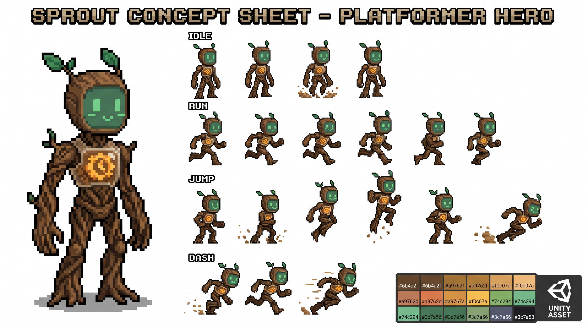
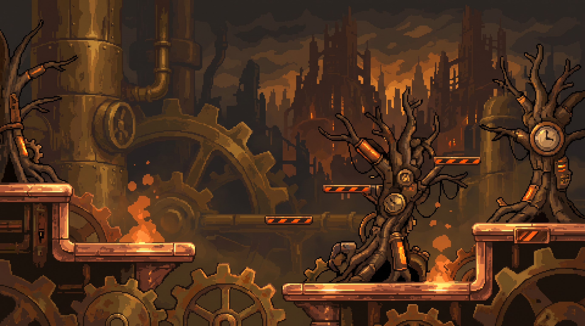
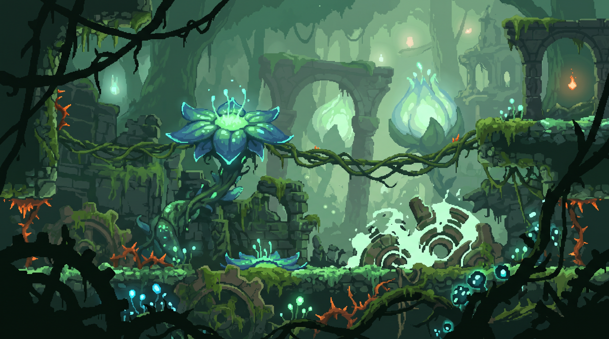
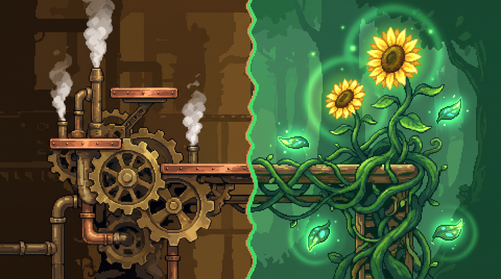

# GEARWOOD — AI 아트 프로덕션 키트

**Art Production Kit · v0.1** (참고: [게임 기획서 v0.2](./gearwood-design-doc.md))

이 문서는 두 부분으로 구성됩니다.

- **Part A** — Midjourney / DALL·E / Stable Diffusion에 바로 입력할 수 있는 이미지 생성 프롬프트 모음
- **Part B** — 아티스트·픽셀 디자이너에게 바로 전달하는 아트 스타일 가이드 (작업 지시서)

두 파트 모두 [기획서 v0.2](./gearwood-design-doc.md)에서 정의한 **브라스(기계) × 모스(자연)** 팔레트를 그대로 계승합니다.

> **현재 구현과의 차이 안내**: 이 문서는 초기 컨셉아트/프롬프트 브리프(v0.1)로, "페인터리 픽셀아트" 스타일을 전제로 한다. 실제 구현은 절차적 드로잉 + AI 생성 스프라이트를 혼합하는 방식이며, 진행 중인 비주얼/UI 리디자인 지침(`CLAUDE.md` 19.19)은 전체를 픽셀아트로 강제 전환하지 않는다고 명시한다. 팔레트·라이팅·대비 규칙(Part B)은 여전히 참고 가치가 있지만, 픽셀아트 여부 자체는 이 문서 대신 `CLAUDE.md` 19장을 따른다.

---

## Part A — AI 이미지 생성 프롬프트

### ① 주인공 '스프라우트' 캐릭터 시트

```
A 2D game character concept sheet for a platformer game hero named 'Sprout'.
Half-mechanical, half-nature spirit. Body made of intertwined tree roots and
wooden textures, with a glowing transparent glass housing in the chest
showing golden clockwork gears inside. A cute glowing LED-like spirit face,
small leaf antenna on head. High detail, painterly pixel art style, sprite
sheet showing idle, run, jump, and dash animations, white background,
8k resolution, Unity game asset --ar 16:9 --v 6.0
```



### ② 맵 — 기계 구역 (Brass & Steam Machinery Zone)

```
A 2D side-scrolling platformer game level background, mechanical steampunk
forest ruins. Massive rusty brass gears, clockwork pipes, orange steam
particles, copper platforming ledges. Painterly pixel art style, 4-layer
parallax depth, dark atmospheric lighting with glowing metallic highlights,
side view, game environment art --ar 16:9 --v 6.0
```



### ③ 맵 — 자연 구역 (Overgrown Moss & Bioluminescence Zone)

```
A 2D side-scrolling platformer game level background, magical
nature-overgrown ruins. Emerald green moss covering old machinery, glowing
bioluminescent blue and green spores, winding vines as platforms, giant
glowing floral structures. Painterly pixel art style, 4-layer parallax
depth, mystical ambient lighting, side view, game environment art
--ar 16:9 --v 6.0
```



### ④ 블룸 시프트 대조 화면 (Bloom Shift Dual-State Concept)

```
Split view concept art for a 2D platformer game environment. Left side
showing a cold mechanical brass gear platform with steam. Right side
showing the exact same platform seamlessly transformed into a blooming
sunflower and vine platform with green aura and floating leaves. Painterly
pixel art style, vivid color contrast, side view --ar 16:9 --v 6.0
```



> **사용 팁**: 캐릭터/맵 프롬프트로 여러 장을 뽑은 뒤, 실제 채택본의 hex 팔레트를 스포이드로 추출해 Part B의 팔레트 표와 맞는지 검수하세요. 어긋나면 `--sref`(Midjourney) 또는 컬러그레이딩 후처리로 보정합니다.

---

## Part B — 아트 스타일 가이드 (작업 지시서)

### 1. 스프라우트 비주얼 그래픽 명세서

**기본 외형**

| 항목 | 규격 |
|---|---|
| 스프라이트 그리드 | 32×40px (기획서 캐릭터 기준 그리드 준수) |
| 리깅 방식 | 8×8px 서브그리드 단위로 헤드/토르소/암/레그 파츠 분리 레이어링 — 코그 교체 시 파츠 단위 스왑을 위해 필수 |
| 애니메이션 세트 | idle 4f · run 6f · jump(상승/정점/낙하 3파트) · dash 2f+잔상 · wall-slide 2f · stomp 2f |

> 프레임 수는 기획서 v0.2의 물리 수치(코요테 타임 4f, 대시 무적 0.15초 등)와 반드시 일치시켜, 애니메이션 타이밍이 실제 판정과 어긋나지 않게 합니다.

**컬러 팔레트 (6色 제한)**

| 부위 | 베이스 | 하이라이트 | 섀도우 |
|---|---|---|---|
| 바디 (뿌리·목재 텍스처) | `#6b4a2f` | `#8f6a45` | `#4a3220` |
| 가슴 코어 (유리 하우징 속 톱니) | `#a9762f` | `#f0c07a` | `#7c5420` |
| 정령 얼굴 (LED 발광) | `#74c294` (평상시) | 피격/경고 시 `#e58058` 전이 | — |
| 리프 안테나 | `#3c7a56` | 잎맥 `#285940` | — |

**발광부위 규칙** — 발광(emissive) 처리는 **가슴 코어 · 얼굴 · 안테나 끝** 3곳으로만 제한합니다. 나머지는 전부 무광 텍스처. 이 3곳이 각각 자원(코어) / 생존·피격(얼굴) / 능력 활성(안테나) 상태를 색으로 구분해 전달하는 역할을 하므로, 새로운 발광 부위를 임의로 추가하지 않습니다.

**코그 장착 시 외형 변화 규칙 (예시 3종)**

1. **발 슬롯 = 스프링 코그** → 발끝에 소형 브라스 압축 스프링 부속 추가. 착지 프레임에 눌림(스쿼시) 1프레임 삽입.
2. **몸통 슬롯 = 루트훅 코그** → 등 쪽에 넝쿨-와이어 하이브리드 로프를 상시 노출. idle 모션에 로프 끝이 흔들리는 2프레임 루프 추가.
3. **머리 슬롯 = 포토신 코그** → 리프 안테나가 2장 → 4장으로 풍성해짐. 광합성 차지 완료 시 안테나 전체가 모스 글로우로 강하게 펄스(3프레임 애니메이션).

---

### 2. '블룸 시프트' 이중 지형 시각화 가이드

**타일셋(Tilemap) 변경 규칙**

- 시프트 가능한 모든 타일은 **기계 타일 / 자연 타일 두 세트를 반드시 1:1 페어로 제작**합니다. 콜리전 박스와 그리드 좌표는 완전히 동일해야 합니다.
- 명명 규칙: `tile_gear_platform_01` ↔ `tile_vine_platform_01` — 접미사 숫자로 짝을 유지해 전환 로직이 이름만으로 매칭되게 합니다.
- 발판 상단 충돌선(top collision line)의 y좌표는 전환 전후 절대 변하지 않습니다. 지형의 **성질**만 바뀌고 **플레이 가능 여부·위치**는 유지되어야 공정한 판정이 보장됩니다.

**이펙트 연출 가이드**

| 연출 요소 | 기계 → 자연 | 자연 → 기계 |
|---|---|---|
| 파티클 | 브라스 파편이 흩어지며 반대편에서 새싹 파티클이 솟아오르는 "교차 스폰" (0.4초) | 잎이 말려 톱니로 굳어지는 역방향 연출 |
| 모션 블러 | 전환 반경 12타일 경계에서 바깥으로 퍼지는 라디얼 블러 (0.2초) | 동일 |
| 글로벌 컬러 트랜지션 | 화면 전체에 모스 틴트 오버레이 펄스 (0.15초, opacity ≤20%) | 브라스 틴트 오버레이 펄스 (동일 수치) |

> 블러·틴트는 전환 범위를 즉시 인지시키는 용도이므로 opacity를 낮게 유지해 화면 가독성을 해치지 않습니다.

---

### 3. UI / UX 라이팅 규칙

**콘트라스트 & 아웃라인 처리**

- 모든 플레이어블 오브젝트(캐릭터·발판·아이템)는 배경 대비 **최소 1.5px 다크 아웃라인** 필수. 배경 레이어는 아웃라인 없이 소프트 블러로 깊이감만 표현합니다.
- 최원경·원경 배경 레이어는 채도 −20% / 명도 −10%로 눌러, 플레이어 시선이 항상 중경의 발판을 먼저 인식하도록 합니다.
- 발광 오브젝트(코인·코어·시프트 노드)는 배경보다 명도 +30% 이상 높여 항상 시선을 유도합니다.

**컬러 스크립트 가이드**

| 구역 | 배경 | 발판 | 하이라이트 | 위험 강조 |
|---|---|---|---|---|
| 기계 구역 | `#7c5420` (딥 브라스) | `#a9762f` | `#ecdcb8` | `#b1502e` (엠버) |
| 자연 구역 | `#285940` (딥 모스) | `#3c7a56` | `#d9ead9` | `#b1502e` (엠버) |

> **핵심 규칙**: 위험 요소(가시·트랩·투사체)는 두 구역 모두에서 항상 **엠버(`#b1502e`) 계열로 통일**합니다. "지형 색은 현재 상태를 말하고, 엠버색은 항상 위험을 말한다"는 규칙을 게임 전체에 예외 없이 적용해, 플레이어가 색만으로 안전/위험을 즉시 판단할 수 있게 합니다.

---

*GEARWOOD — Art Production Kit v0.1 · Companion to Game Design Document v0.2*
